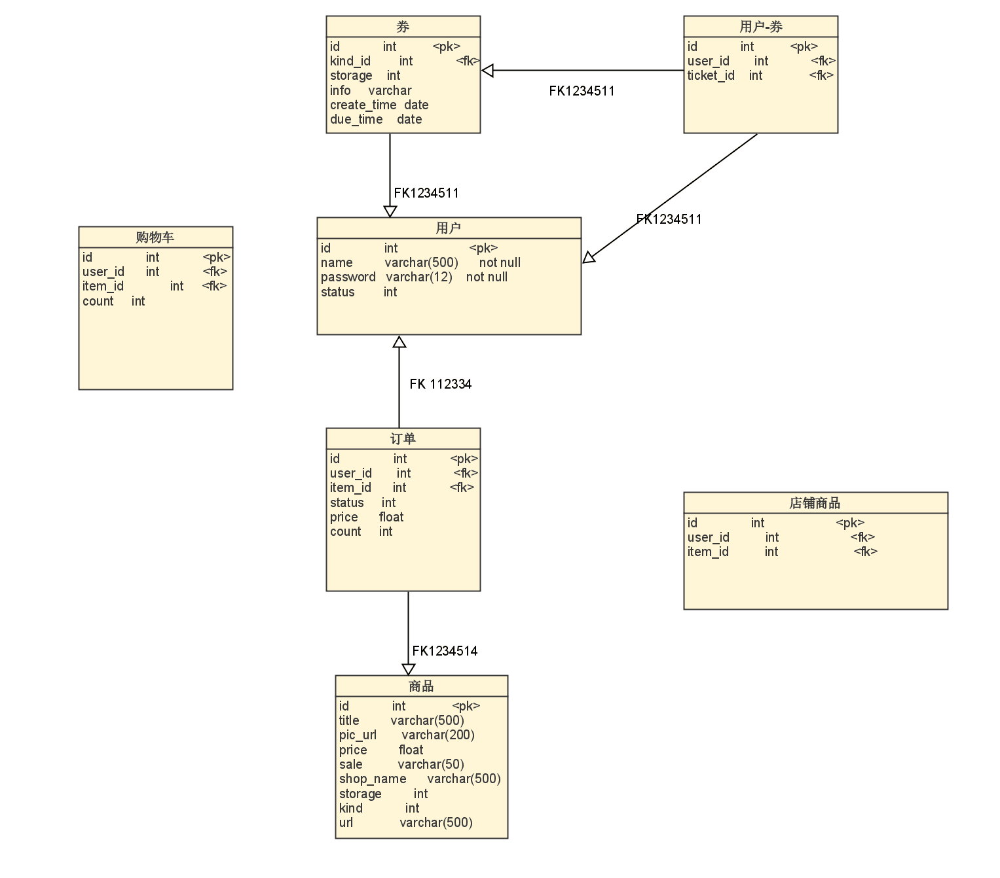

# SuperSupermarket


一款简易的购物Web应用

A simple shopping web application

---

## Todo List

>项目开发期阶段记录

### Phase-1

项目初期的准备与分工。

- [X] 数据项汇总与得分点对应
- [X] 数据库设计与类图绘制
- [X] 数据爬取
- [X] 建立数据库
- [X] 前端设计

### Phase-2

前后端的结合与细节功能实现。

- [X] 主页轮换图
- [X] 主页商品随机推送
- [X] 订单
- [ ] 购物车
- [X] 购物券

### Phase-3

后续的优化与改进。

- [X] 主页界面美化
- [X] 搜索界面美化
- [X] 触发器与事务的应用
- [ ] 备份

## 数据库设计

根据购物应用的功能设计数据库的类图如下：

<p align="center">
  
</p>

## 数据爬取

商品信息来源为某宝，商品条目数总计12857条，以csv保存后续录入数据库

### 数据项汇总

1. id--商品ID，根据商品条目数累加
2. title--商品名/显示标题
3. pic_url--图片URL
4. price--售价
5. sale--销售量
6. shop_name--店铺名
7. storage--库存
8. kind--类别
9. url--详情链接

### 商品种类约定

```python
kind = {
  '电脑': 1,
  '手机': 2,
  '女装': 3,
  '食品': 4,
  '宠物': 5,
  '美妆': 6,
  '鲜花': 7,
  '图书': 8
}
```
