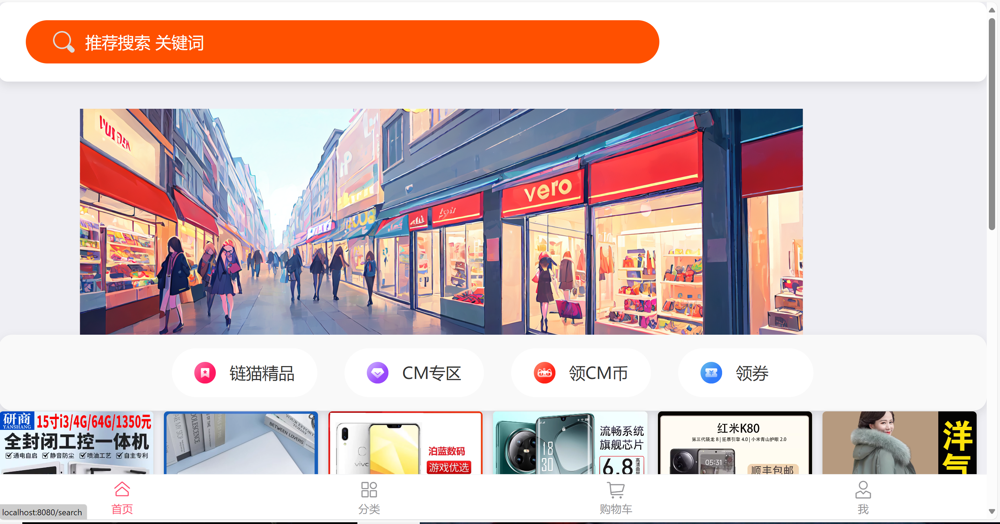
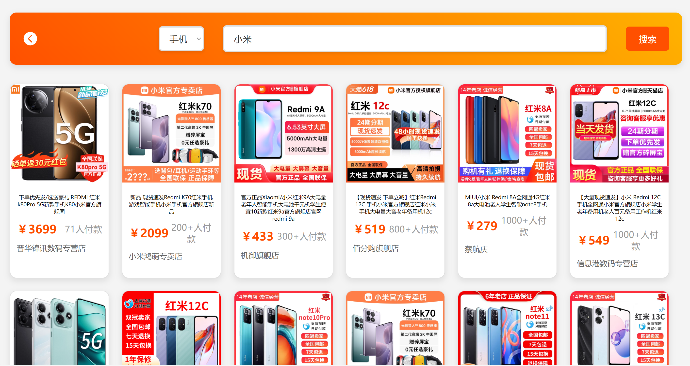
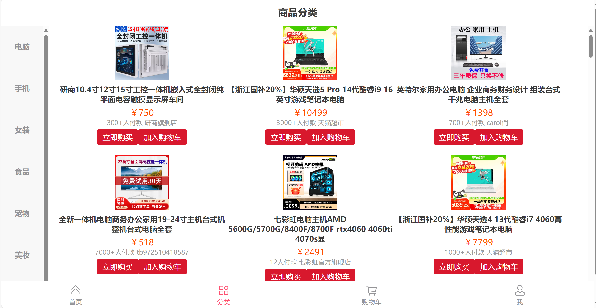
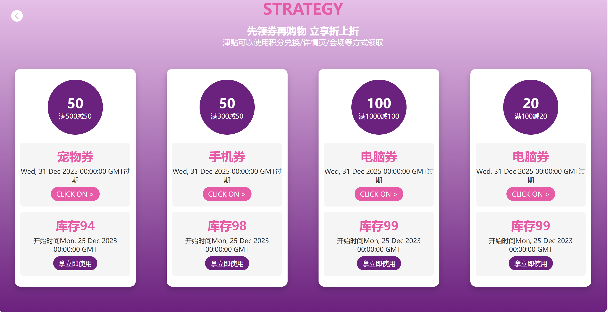
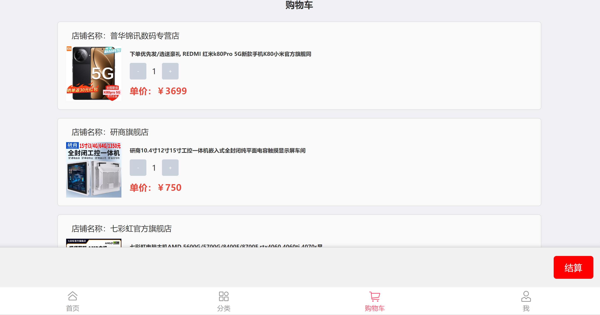
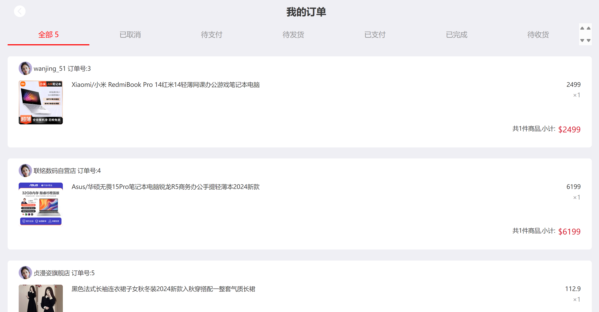
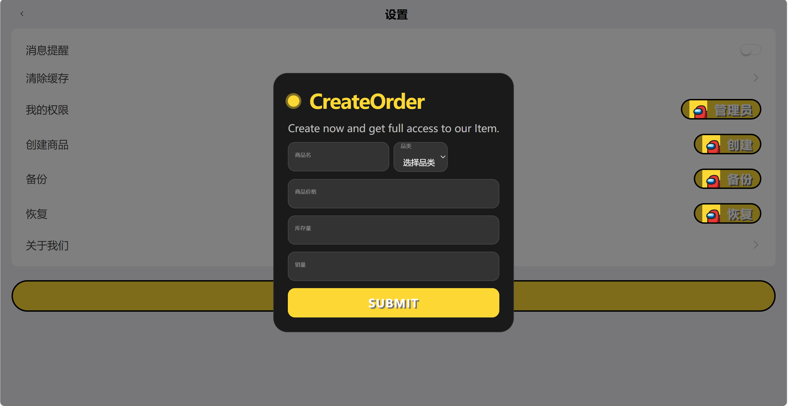
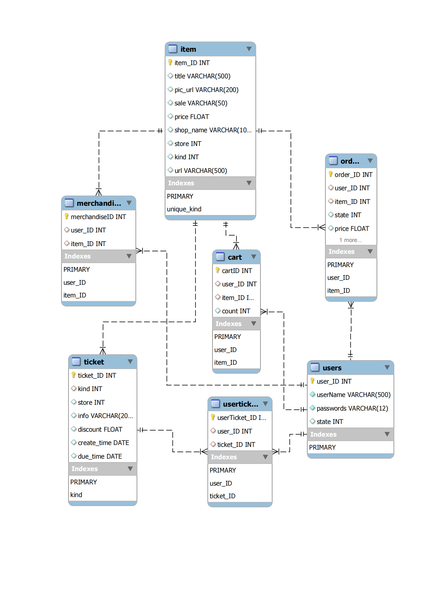

# SuperSupermarket


一款简易的购物Web应用，支持MySQL，仓库中包含完整的前后端代码与支持项目所需的数据与SQL语句

A simple shopping web application

---

## 项目特点

- 良好的数据库支持
- 使用原生SQL语句
- 提供数据获取代码
- 基于Vue与Flask框架
- 前后端分离

---

## 项目展示

- **商城主页**

包含搜索框、轮换图、随机商品推送等

<p align="center">
  
</p>

- **搜索栏**

支持按类搜索

<p align="center">
  
</p>

- **分类视图**

按类罗列商品

<p align="center">
  
</p>

- **购物券领取**

领取购买物品的优惠券

<p align="center">
  
</p>

- **购物车**

想买的加入购物车的宝贝

<p align="center">
  
</p>

- **订单**

已结算的宝贝

<p align="center">
  
</p>

- **权限**

例如商家/管理员可以上架商品

<p align="center">
  
</p>

---

## Todo List

>项目开发期阶段记录

### Phase-1

项目初期的准备与分工。

- [X] 数据项汇总与得分点对应
- [X] 数据库设计与类图绘制
- [X] 数据爬取
- [X] 建立数据库
- [X] 前端设计

### Phase-2

前后端的结合与细节功能实现。

- [X] 主页轮换图
- [X] 主页商品随机推送
- [X] 订单
- [X] 购物车
- [X] 购物券

### Phase-3

后续的优化与改进。

- [X] 主页界面美化
- [X] 搜索界面美化
- [X] 触发器与事务的应用
- [X] 数据库备份
- [X] 不同用户权限

## 数据库设计

根据购物应用的功能设计数据库的类图如下：

<p align="center">
  
</p>

---

## 附录

### 商品信息

商品信息来源为某宝，商品条目数为了从简设计仅保留总计12857条，以csv保存后续录入数据库

#### 数据项汇总

1. id--商品ID，根据商品条目数累加
2. title--商品名/显示标题
3. pic_url--图片URL
4. price--售价
5. sale--销售量
6. shop_name--店铺名
7. storage--库存
8. kind--类别
9. url--详情链接

#### 商品种类约定

```python
kind = {
  '电脑': 1,
  '手机': 2,
  '女装': 3,
  '食品': 4,
  '宠物': 5,
  '美妆': 6,
  '鲜花': 7,
  '图书': 8
}
```

---

*If you find our project helpful, give us a star, plz.*
